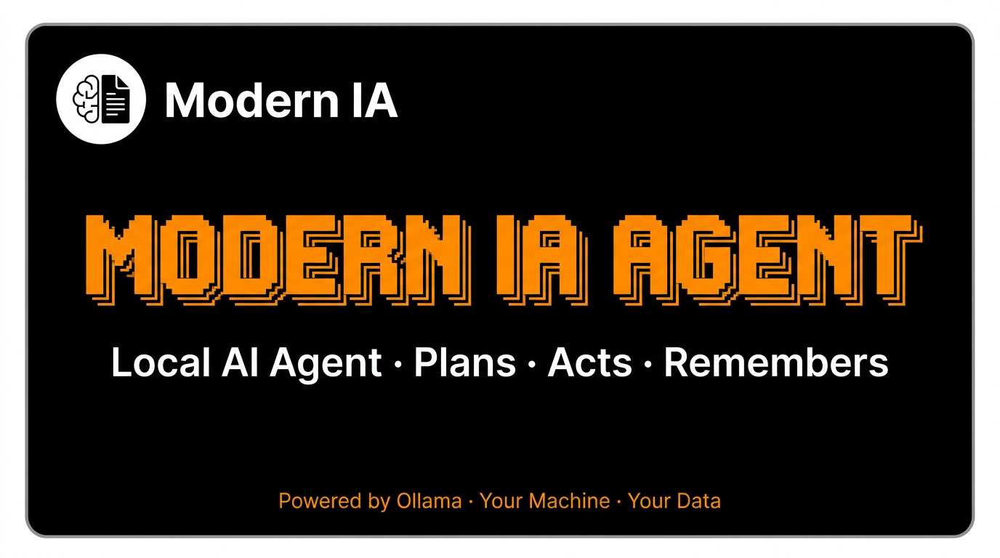
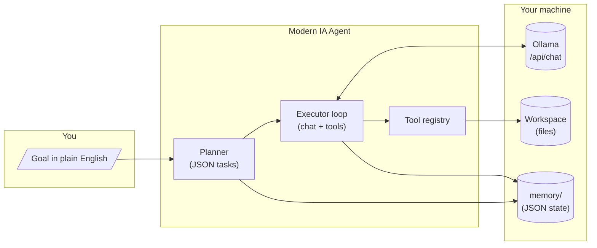
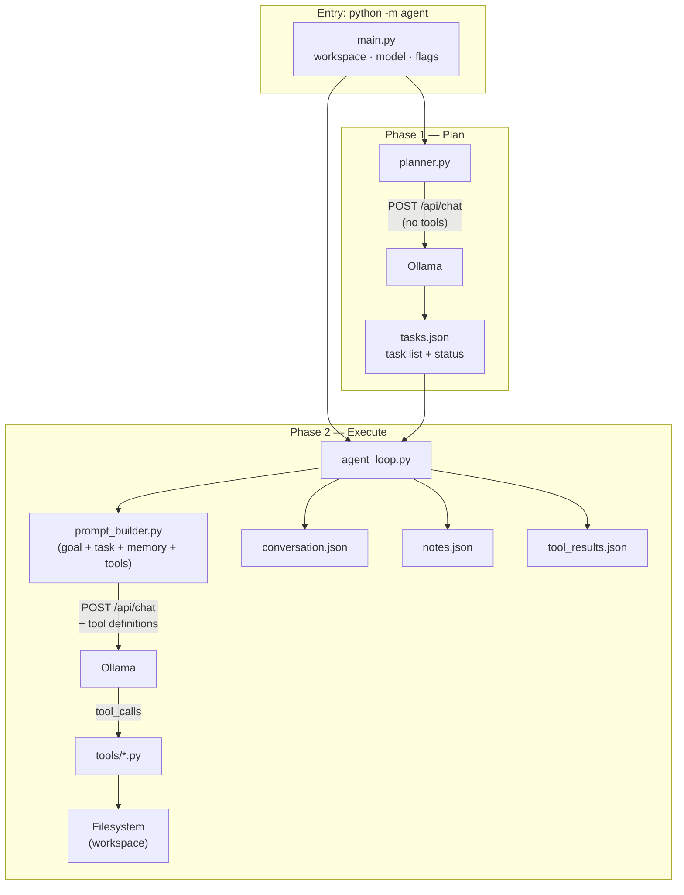
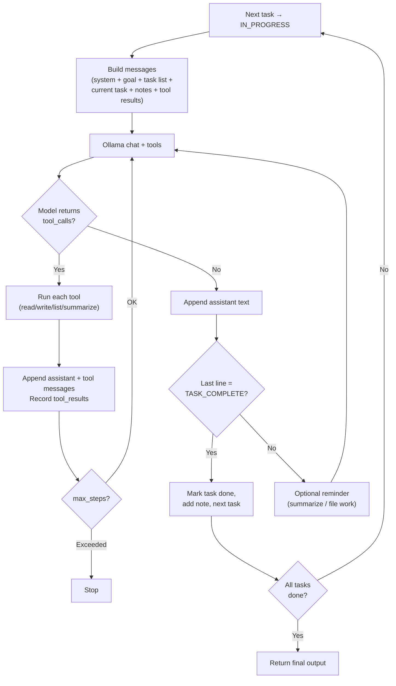
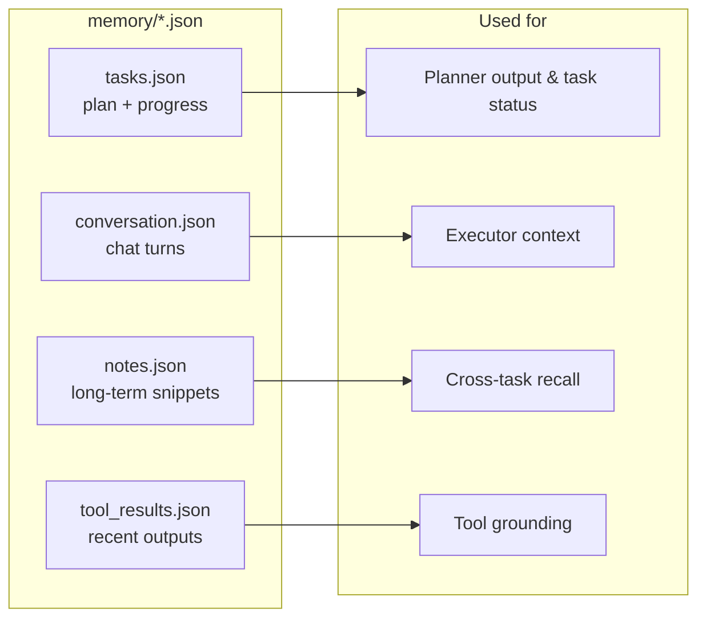

<div align="center">



# Modern IA Agent

**Your goals. Your files. Your GPU.**  
A **local-first** AI agent that **plans**, **acts** on your filesystem, and **remembers**—powered by [Ollama](https://ollama.com/), with **no cloud LLM required**.

[](https://www.python.org/)
[](https://ollama.com/)
[](#license)

[Features](#-what-you-get) · [Architecture](#-architecture-at-a-glance) · [Quick start](#-quick-start) · [CLI](#-command-line)

</div>

---

## Why this exists

| | |
|--|--|
| **Privacy** | The model runs on **your machine** via Ollama. Your codebase and goals are not sent to a third-party API for inference. |
| **Clarity** | The agent **writes a visible plan** (ordered tasks) before executing—so you see *what* it will do, not just a black box. |
| **Control** | Tools are **filesystem-only** (read, write, list, summarize). No surprise shell commands or GUI automation. |
| **Continuity** | **JSON memory** under `memory/` keeps conversation, tasks, and tool context—useful for longer runs and debugging. |

---

## What you get

- **Planner** — Breaks your high-level goal into **3–12 concrete tasks** (JSON), constrained to real file capabilities.
- **Executor loop** — Works **one task at a time**, calling Ollama with **function tools** until the model signals completion (`TASK_COMPLETE`).
- **Four tools** — `read_file`, `write_file`, `list_files`, `summarize_file` on a workspace you choose.
- **Safety rails** — `--max-steps`, `--num-predict`, and optional `--fresh` to limit runaway generations and stale chat.

---

## How it flows (end to end)

From a single sentence to finished file work—**plan first**, then **execute with tools**.



---

## Architecture at a glance

The **planner** and **executor** share the same Ollama server but different prompts: one outputs **only a task list**, the other **uses tools** and finishes steps with **`TASK_COMPLETE`**.



---

## Inside the executor loop

Each **step** is one model turn: either **tool calls** (batched), **text + completion**, or **deterministic helpers** (e.g. listing a folder when appropriate). Tasks advance when the reply ends with an accepted **completion line**.



---

## Memory model (what gets saved)

All persistent state lives under **`memory/`** (you can `.gitignore` these for a clean repo).



---

## Quick start

**Prerequisites:** Python **3.10+**, [Ollama](https://ollama.com/) installed and running, model pulled (e.g. `ollama pull mistral`).

```bash
git clone https://github.com/<your-username>/ModernIAAgent.git
cd ModernIAAgent
python -m venv .venv
# Windows: .venv\Scripts\Activate.ps1   |   Unix: source .venv/bin/activate
pip install -r requirements.txt
ollama serve   # if not already running
python -m agent "Summarize the README files in this folder" --fresh
```

Run from the **repository root** so `python -m agent` resolves. Use **`--workspace` / `-w`** to point file tools at your project directory.

---

## Command line

| Option | Description |
|--------|-------------|
| `goal` or `--goal` / `-g` | What you want done (required). |
| `--model` / `-m` | Ollama tag (default: `mistral:latest`). |
| `--ollama` | Base URL (default: `http://127.0.0.1:11434`). |
| `--workspace` / `-w` | Directory for file tools (default: cwd). |
| `--max-steps` | Max LLM steps (default: `200`). |
| `--timeout` | HTTP read timeout seconds (default: `600`). |
| `--num-predict` | Max tokens per reply (default: `4096`). |
| `--fresh` | Clear `conversation.json` and `tool_results.json` before run. |
| `--verbose` / `-v` | Debug logging. |

**Exit codes:** `0` success, `1` if Ollama is unreachable or planning fails.

---

## Project layout

```text
ModernIAAgent/
├── agent/           # CLI, loop, Ollama client, planner, prompts, memory helpers
├── tools/           # read_file, write_file, list_files, summarize_file
├── memory/          # runtime JSON (gitignored by default for session data)
├── requirements.txt
└── README.md
```

---

## Limitations (honest scope)

- **No shell** — Cannot run terminal commands; only the four file tools.
- **Paths** — Give explicit paths in your goal; the planner avoids inventing user-specific directories.
- **Model-dependent** — Tool use and `TASK_COMPLETE` behavior depend on your Ollama model.

---

## Contributing

Issues and PRs are welcome. Keep changes focused and consistent with existing patterns (typing, logging, small modules).

---

## License

Add a `LICENSE` file (e.g. MIT or Apache-2.0) when you publish. Until then, rights remain with the author unless stated otherwise.
